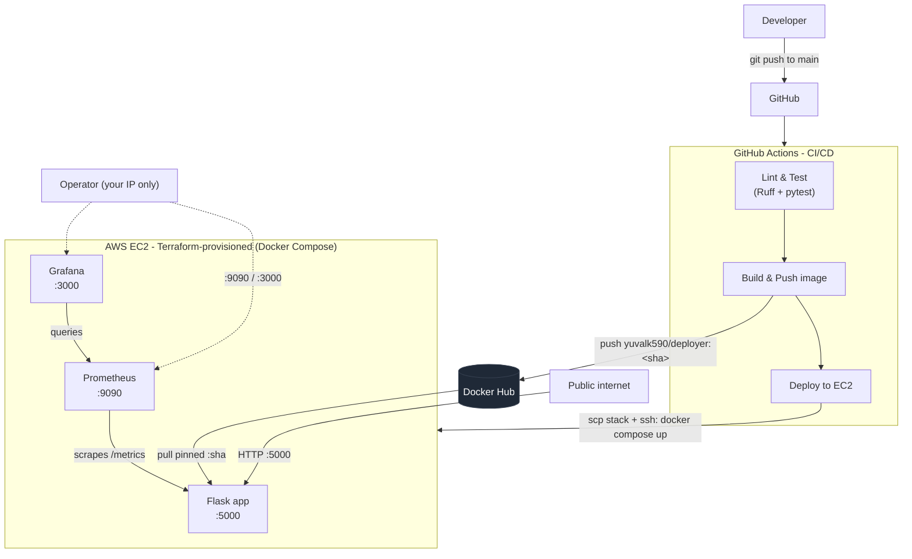
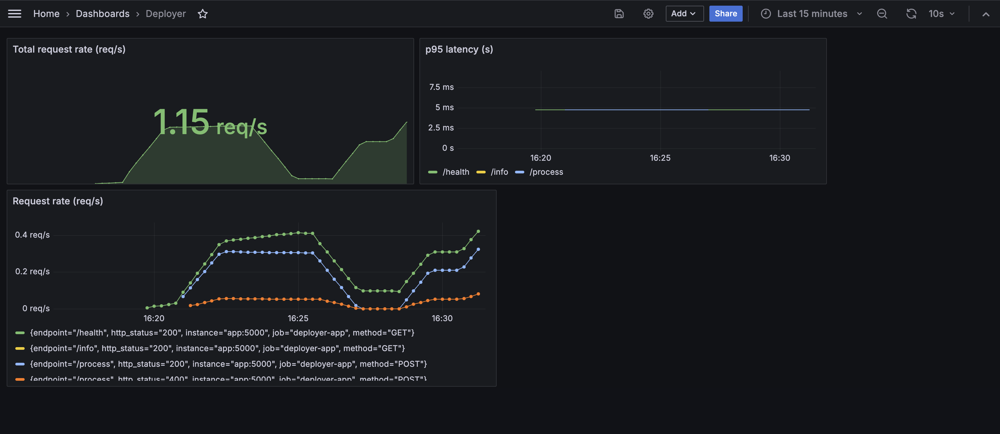

# Deployer

[](https://github.com/YuvalKandov/deployer/actions/workflows/ci-cd.yml)

**A trivial Flask API wrapped in a complete, production-shaped DevOps lifecycle** - containerized, provisioned on AWS with Terraform, deployed by a GitHub Actions CI/CD pipeline, and monitored with Prometheus + Grafana.

The application itself is deliberately small. **The infrastructure around it is the point**: this repo demonstrates the full path from a `git push` to a running, observable service on real cloud compute - every layer built and wired by hand.

---

## Architecture



A **Jenkinsfile** lives alongside the GitHub Actions workflow (lint/test/build only - no deploy). It mirrors the CI stages to demonstrate pipeline breadth across both ecosystems; GitHub Actions remains the single source of truth for what's actually deployed.

---

## Why these tools (the design reasoning)

Every choice here targets a real-world tradeoff, not just "what's easiest."

| Decision | Chosen | Why |
|---|---|---|
| **Compute** | EC2 over Lambda | Exercises real compute, networking, SSH, and OS-level concerns that serverless hides. |
| **IaC** | Terraform | Industry-standard, cloud-agnostic HCL; the most common IaC requirement in job listings. |
| **CI/CD** | GitHub Actions | First-class GitHub integration, hosted runners, zero infra to maintain. |
| **CI (breadth)** | Jenkinsfile alongside | Demonstrates the on-prem/self-hosted pipeline model still dominant in enterprise. |
| **Registry** | Docker Hub over ECR | Simpler and free, still industry-standard; avoids over-indexing on one cloud. |
| **Monitoring** | Prometheus + Grafana | The de-facto open-source observability stack: pull-based metrics + dashboards/alerts. |
| **State** | S3 remote backend (native locking) | Shared, versioned, locked Terraform state - the team-ready pattern over local state. |

---

## The application

A minimal Flask service (the "vehicle"), instrumented with Prometheus metrics:

| Method | Endpoint | Purpose |
|---|---|---|
| `GET` | `/health` | Liveness check - `{ status, timestamp }`. Used by the Docker `HEALTHCHECK`. |
| `GET` | `/info` | Version, uptime, and hostname (the container ID, proving which instance answered). |
| `POST` | `/process` | Trivial work - reverses `text` and returns char/word counts. Generates metric activity. |
| `GET` | `/metrics` | Prometheus exposition format - request counts, latency histogram, in-flight gauge. |

```bash
curl http://<HOST>:5000/health
curl http://<HOST>:5000/info
curl -X POST http://<HOST>:5000/process -H 'Content-Type: application/json' -d '{"text":"hello world"}'
```

---

## Repository layout

```
.
├── app/                          # Flask app + Prometheus instrumentation
│   ├── main.py                   #   routes
│   ├── metrics.py                #   prometheus-client: counter / histogram / gauge + /metrics
│   ├── requirements.txt          #   runtime deps (Flask, prometheus-client)
│   ├── requirements-dev.txt      #   + pytest, ruff
│   └── tests/
├── Dockerfile                    # multi-stage, non-root, HEALTHCHECK
├── docker-compose.yml            # base - production-safe, image-only (the box runs this)
├── docker-compose.override.yml   # local-dev only - adds build: (auto-merged, never shipped)
├── monitoring/
│   ├── prometheus.yml            # scrape config
│   ├── alert.rules.yml           # AppDown, HighRequestLatency
│   ├── grafana-dashboard.json    # dashboard, provisioned as code
│   └── grafana/provisioning/     # datasource + dashboard providers
├── terraform/                    # VPC, subnet, SG, EC2, EIP, user-data Docker bootstrap
│   └── bootstrap/                # one-time S3 state-backend module
├── .github/workflows/ci-cd.yml   # lint+test → build+push → deploy
└── Jenkinsfile                   # breadth: lint/test/build (no deploy)
```

---

## CI/CD pipeline

On every push to `main` (PRs run the first job only - they validate but never deploy):

1. **Lint & Test** - `ruff check` then `pytest` on a fresh runner.
2. **Build & Push** - build the image and push two tags to Docker Hub: `:latest` (moving) and `:<commit-sha>` (immutable, traceable).
3. **Deploy to EC2** -
   - **Just-in-time SSH access**: SSH (22) is locked to the operator's IP, so the runner's ephemeral IP is blocked. The job authorizes its own `/32` in the security group, deploys, then **revokes it** (`if: always()`, so the hole closes even on failure).
   - **Ship the stack**: `scp` the compose file + `monitoring/` config to the box (the runner already holds the exact commit; no credentials live on the server).
   - **Roll the release**: `docker compose pull && up -d`, with the app image pinned to the just-built `:<sha>`.

**The image is built once in CI and only ever *pulled* on the box** - the server has no source code and cannot build. This is enforced structurally: the base `docker-compose.yml` is image-only; a `docker-compose.override.yml` adds `build:` back for local development and is never copied to the server.

---

## Monitoring

<a href="docs/screenshots/grafana-dashboard.png">
  
</a>

<sub>*The Grafana dashboard under synthetic load — request rate, p95 latency per endpoint, and a per-endpoint breakdown (incl. `/process` 4xx). Provisioned from git. Click to enlarge.*</sub>

- **Prometheus** scrapes the app's `/metrics` every 15s over the Compose network and evaluates alert rules:
  - `AppDown` - `up == 0` for 1m (the `for:` clause suppresses transient blips).
  - `HighRequestLatency` - p95 latency > 0.5s for 5m.
- **Grafana** is **provisioned entirely as code** - datasource and dashboard load from git on first boot, no manual clicks. A fresh volume re-provisions identically.

> The Prometheus (`:9090`) and Grafana (`:3000`) UIs are firewalled to the operator's IP only. The app (`:5000`) is the sole public surface.

---

## Running it yourself

### Prerequisites
- AWS account + AWS CLI configured
- Terraform ≥ 1.10
- An SSH keypair at `~/.ssh/deployer_key{,.pub}` (`ssh-keygen -t ed25519 -f ~/.ssh/deployer_key`)
- Docker (for local runs)

### Local (no AWS)
```bash
docker compose up --build        # builds the app, runs the full stack locally
# app → localhost:5000   prometheus → localhost:9090   grafana → localhost:3000 (admin/admin)
```

### Provision the infrastructure
```bash
# one-time: create the S3 state backend
cd terraform/bootstrap && terraform init && terraform apply

# provision the box
cd terraform
cp terraform.tfvars.example terraform.tfvars   # set my_ip_cidr to "$(curl -s ifconfig.me)/32"
terraform init && terraform apply
terraform output instance_public_ip            # the EIP
```

### Wire up CI/CD
Set these GitHub Actions secrets, then push to `main`:

| Secret | Value |
|---|---|
| `DOCKERHUB_USERNAME` / `DOCKERHUB_TOKEN` | Docker Hub login (token, not password) |
| `SSH_PRIVATE_KEY` | contents of `~/.ssh/deployer_key` |
| `EC2_HOST` | the EIP from `terraform output` |
| `EC2_SG_ID` | the security group id (`terraform output security_group_id`) |
| `AWS_ACCESS_KEY_ID` / `AWS_SECRET_ACCESS_KEY` | a least-privilege CI user (JIT-SSH ingress only) |

> `EC2_HOST` and `EC2_SG_ID` are reborn on every `terraform apply` - update them after each.

### Tear down (cost hygiene)
```bash
cd terraform && terraform destroy
```
> A detached Elastic IP and a running `t3.micro` both incur charges. Destroy when you're done. The S3 state bucket persists (effectively free).

---

## What this project demonstrates

- **Infrastructure as Code** - a VPC, subnet, security groups, EC2, and EIP defined declaratively, with remote locked state.
- **Container best practices** - multi-stage build, non-root user, `HEALTHCHECK`, dev/prod parity via Compose override.
- **CI/CD** - gated jobs, immutable image tagging, secret management, and a just-in-time access pattern that never leaves SSH open.
- **Observability** - application instrumentation, pull-based scraping, dashboards-as-code, and validated alerting.